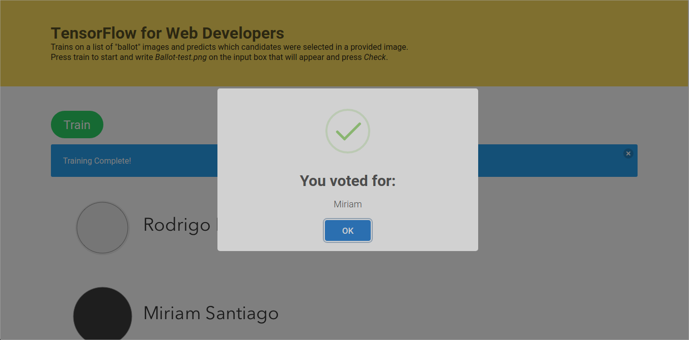

# TensorFlow for Web Developers Demo
A ballot reader created to demo [TensorFlow.js](https://js.tensorflow.org/).

***Disclaimer**: The training takes up a lot of memory. I advise against training on the browser on production, but this is for demo purposes. Just do prediction when in production. Plez.

Also I know the code looks horrible. Sarreh.*

## Screenshot

## Description
Trains on a list of *ballot* images and predicts which candidates were selected in a provided image. 

Press `Train` to start, wait for it to complete, and write `Ballot-test.png` on the input box that will appear and press `Check`.

You can try predicting with the other images there. Just browse the `public/ballots` folder and enter a filename on the box.